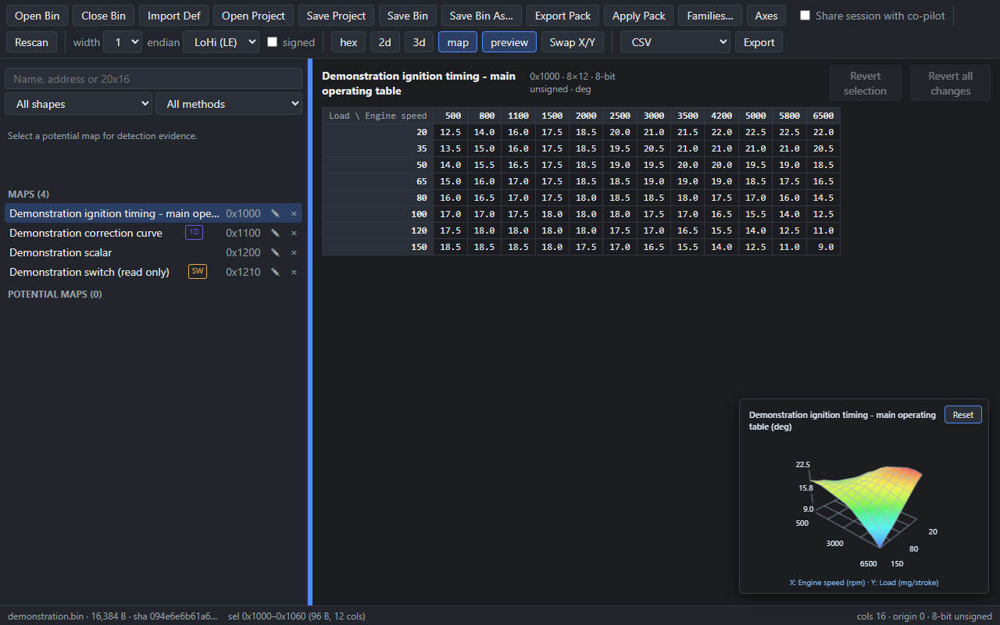

<p align="center">
  
</p>

<h1 align="center">BimmerStein Bin Analyzer</h1>

<p align="center"><strong>ECU Binary Analysis and Map Editing</strong></p>
<p align="center">A focused Windows workspace for finding, understanding and editing calibration tables.</p>

<p align="center">
  <a href="https://github.com/CAATZ/bimmerstein-bin-analyzer/releases"><strong>Downloads</strong></a>
  &nbsp;&middot;&nbsp;
  <a href="manual/USER_MANUAL.md">User Manual</a>
  &nbsp;&middot;&nbsp;
  <a href="manual/BimmerStein-Bin-Analyzer-User-Manual.pdf">PDF Manual</a>
  &nbsp;&middot;&nbsp;
  <a href="https://github.com/CAATZ/bimmerstein-bin-analyzer/issues">Issues &amp; Feedback</a>
</p>

<p align="center"><code>Windows x64</code> &nbsp; <code>BMW Siemens MS41 focused</code> &nbsp; <code>GPL-3.0-or-later</code></p>

<p align="center">
  <a href="https://github.com/CAATZ/bimmerstein-bin-analyzer/actions/workflows/ci.yml"></a>
</p>

---

## Overview

Open a saved ECU firmware image, detect potential maps, inspect their axes and
byte layout, and build a reviewed set of calibration definitions. Edit table
values, save a separate BIN with supported checksum correction and read-back
verification, or export definitions for another editor.



**Latest release: [v0.2.18](https://github.com/CAATZ/bimmerstein-bin-analyzer/releases/tag/v0.2.18).**
This release adds a resizable map sidebar, Close Bin, confirmation before
replacing an open session, labeled 3D surfaces and a rotatable preview.
The complete user manual is included below and with the release downloads.

## What you can do

- Find potential maps using family analysis, stored structures, shared axes and
  generic byte patterns; search by name, address or dimensions and read the
  detection evidence.
- Inspect raw bytes, 2D traces, tables, curves, scalar values and named switch
  states. Rotate a 3D surface with breakpoint labels and physical units.
- Import RomRaider definitions; review table boundaries and axis pairs; add
  conversion factors and organize shared axes in a reusable library.
- Edit table values and stored breakpoints with undo/redo, original-value
  comparison and byte-level change highlighting.
- Save an edited BIN separately from its source, verify the written bytes, and
  inspect corrected, uncorrectable and unchecked checksum regions.
- Save projects and lineage; export RomRaider XML, TunerPro XDF, CSV/JSON map
  lists and reviewed map packs.

The app is **offline**: it edits files and does not communicate with or flash an
ECU. Detection confidence does not establish a table's meaning or tuning safety.
MS41 program checksums are reported but never rewritten. Switch states are
currently read-only. There is no Android version; macOS/Linux builds are untested.

## Install and start

1. Download the intended Windows x64 release as an `.msi` or `-setup.exe`.
2. Run the installer and launch **BimmerStein Bin Analyzer**.
3. Click **Open Bin**, then import a matching definition if available.
4. Select a table and use **map**, **3d**, or **preview** to inspect it.

Installers are unsigned. Windows SmartScreen may warn on first run; verify the
release source and filename before proceeding. WebView2 Runtime is required.
The [user manual](manual/USER_MANUAL.md) covers installation, every main workflow,
conversion factors, shortcuts and troubleshooting.

**Save Bin saves bytes. Save Project saves definitions and axes.** Save the BIN
first, then its project, to retain an edited calibration and its descriptions.

## Build from source

Install the prerequisites below, then run **build-installer.cmd** from the
repository root. It installs workspace packages and builds the Windows app.
Installers are written under `apps/desktop/src-tauri/target/release/bundle/`;
the standalone executable is `apps/desktop/src-tauri/target/release/desktop.exe`.
The first Rust build can take several minutes.

For development with automatic reload, use **run-app.cmd** or the commands below.

## Architecture

Tauri 2 desktop shell, all logic in TypeScript (pnpm monorepo):

| Package | Purpose |
|---|---|
| `packages/core` | Types, value codecs, scaling, project model. Depends on nothing. |
| `packages/engine` | Map-detection pipeline. Pure (no fs/DOM); runs in a Web Worker. |
| `packages/formats` | RomRaider XML, TunerPro XDF, CSV/JSON, project file. Pure. |
| `packages/families` | Per-ECU-family byte semantics: image identity and checksum verify/correct. Pure. |
| `packages/appkit` | Adapter helpers shared by the two apps (definition address framing). Pure. |
| `packages/eval` | Detection-quality harness (Node CLI) with ground-truth fixtures. |
| `apps/desktop` | Tauri 2 + Vite + Svelte 5 UI. |
| `apps/mcp` | Stdio server exposing the engine — and, when attached to a running app, that live session — to external tooling. See [apps/mcp/README.md](apps/mcp/README.md). |

File I/O lives only in `apps/*` and `packages/eval`; the five `packages/*`
libraries above them are pure and import nothing from an app.

## Prerequisites

To build from source (either launcher, or the commands below):

- Node.js ≥ 22 LTS, pnpm ≥ 9 (`corepack enable`)
- Rust stable + [Tauri 2 prerequisites](https://tauri.app/start/prerequisites/),
  including the MSVC "Desktop development with C++" workload
- WebView2 Runtime — ships with Windows 11 already; Windows 10 users may need
  to install it from [Microsoft](https://developer.microsoft.com/microsoft-edge/webview2/)
  first

## Development

```sh
pnpm install
pnpm test        # all package tests (Vitest)
pnpm typecheck
pnpm eval        # detection-quality report against fixtures
pnpm dev         # desktop app (Tauri window; first run compiles Rust — minutes)
```

To rebuild the printable manual, install Python's `reportlab` package and run
`python manual/build_manual.py`. The Markdown manual and its screenshots are
the source for the PDF.

## Fixtures & firmware

Real ECU firmware dumps are copyrighted and **never committed** — see [fixtures/README.md](fixtures/README.md). CI uses committed synthetic bins with planted maps.

## Continuous integration

Every push/PR runs `pnpm install`, `pnpm typecheck`, `pnpm test`, and three
detection-quality gates — `pnpm eval`, `pnpm eval holdout` (anti-overfitting)
and `pnpm eval accept` — see
[.github/workflows/ci.yml](.github/workflows/ci.yml). The first two score the
committed synthetic fixtures. `pnpm eval accept` is the real-firmware
acceptance gate: it runs in CI as well, but the real MS41 bins are gitignored
and never present there, so it skips those rows cleanly and only does real work
on a machine that has them in `fixtures/ms41/`.

## Contributing

Bug reports and pull requests are welcome. [CONTRIBUTING.md](CONTRIBUTING.md)
covers the setup, the package boundaries, and the invariants that keep
detection quality honest — most importantly that the quality gates are
ratchets and are never relaxed to make a change fit.

Security issues: please follow [SECURITY.md](SECURITY.md) rather than opening a
public issue.

## Legal

Independent, original work. Not affiliated with, endorsed by, or sponsored by
any vehicle or ECU manufacturer.

Third-party components bundled in the installers are attributed in [NOTICE](NOTICE).

Copyright © 2026 BimmerStein Bin Analyzer contributors. License: [GPL-3.0-or-later](LICENSE).
