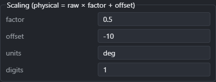
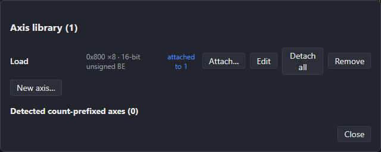
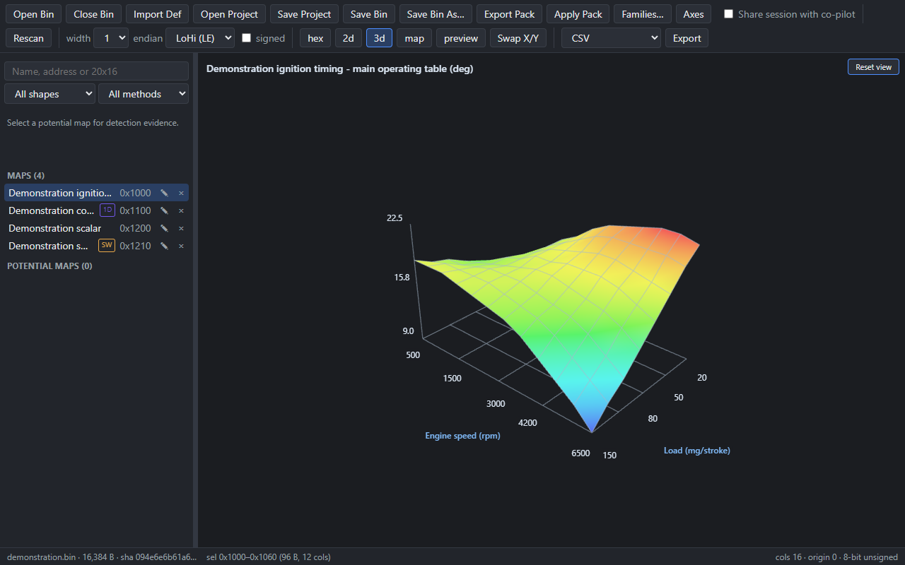
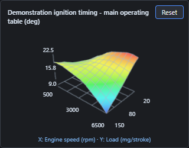

# BimmerStein Bin Analyzer

## User Manual

**ECU Binary Analysis and Map Editing**

Version 0.2.18 | Windows x64 | September 2026

This manual covers the 0.2.18 application. Check the version of your installed
release if a control described here is missing. Screenshots use synthetic
demonstration data; they are not tuning recommendations or real ECU calibrations.

[Printable PDF](BimmerStein-Bin-Analyzer-User-Manual.pdf) |
[Downloads](https://github.com/CAATZ/bimmerstein-bin-analyzer/releases) |
[Issues and feedback](https://github.com/CAATZ/bimmerstein-bin-analyzer/issues)

### Contents

1. [What the app does](#1-what-the-app-does)
2. [Install and start](#2-install-and-start)
3. [First session](#3-first-session)
4. [Workspace and navigation](#4-workspace-and-navigation)
5. [Detection and reviewing a found table](#5-detection-and-reviewing-a-found-table)
6. [Definitions and addresses](#6-definitions-and-addresses)
7. [Conversion factors and table properties](#7-conversion-factors-and-table-properties)
8. [Axes and the axis library](#8-axes-and-the-axis-library)
9. [Table, curve and switch views](#9-table-curve-and-switch-views)
10. [3D surfaces and preview](#10-3d-surfaces-and-preview)
11. [Editing and undo](#11-editing-and-undo)
12. [Saving BINs and reading checksum reports](#12-saving-bins-and-reading-checksum-reports)
13. [Projects, closing and replacing files](#13-projects-closing-and-replacing-files)
14. [Exports and map packs](#14-exports-and-map-packs)
15. [Family modules and session sharing](#15-family-modules-and-session-sharing)
16. [Keyboard reference](#16-keyboard-reference)
17. [Troubleshooting and support](#17-troubleshooting-and-support)

<!-- pagebreak -->

## 1. What the app does

BimmerStein Bin Analyzer opens a saved ECU firmware image, searches for potential
calibration tables, and lets you inspect their layout, axes and values. You can
import RomRaider definitions, refine detected tables, edit values, save a separate
BIN, and export definitions or map packs.

The primary validated family is **BMW Siemens MS41**, including stock and
community variants. Other images can be inspected with the generic detector,
but a plausible shape does not establish a table's function or correct scaling.
Detection does not guarantee every map, scalar, switch or runtime-dependent
structure has been found. A high confidence score is not a tuning approval.

File analysis and editing run locally on Windows. The app does not connect to, read, write or
flash an ECU. There is no Android version. Use your separate flashing tool for
ECU transfers after independently reviewing the output.

Keep an unchanged source BIN and the matching definitions. A checksum result
describes the regions the app checked; it does not establish mechanical safety,
firmware compatibility or the suitability of a calibration for an engine.

### The three files you may save

| File | What it contains | Main command |
|---|---|---|
| BIN | Firmware bytes, including your value edits and supported checksum corrections | Save Bin / Save Bin As |
| Project (`.binproj.json`) | Map definitions, axes, potential maps, format defaults and the referenced BIN identity | Save Project |
| Definition or map list | Descriptions of tables for another editor or analysis tool | Export |

A project does **not** contain the BIN bytes or an unsaved edit history. Save
the BIN first, then the project, when keeping an edited calibration.

## 2. Install and start

1. Open the project's **Downloads** link and choose the intended version.
2. Download the Windows x64 `-setup.exe` or `.msi` installer. Choose one installer
   format for your installation.
3. Run the installer and follow its prompts, then launch **BimmerStein Bin Analyzer**.
4. If the app cannot start because WebView2 is unavailable, install the Microsoft
   Edge WebView2 Runtime, then try again.

Installers are unsigned. Windows may display a SmartScreen warning. Verify the
download source and release filename before choosing to proceed. Source build
instructions are in the repository README.

Updating the application does not replace your separately saved BINs, projects
or exported definitions. Keep backups of those files before updating.

## 3. First session

1. Click **Open Bin** and select a firmware file, or drop it onto the app window.
2. Check the file name, byte size and abbreviated SHA-256 in the bottom status
   bar. File identity matters more than its name.
3. Wait for **scan done**. **Cancel scan** stops a running scan; **Rescan** starts
   another scan of the current working bytes.
4. If you have the matching RomRaider definition, click **Import Def**, choose
   its XML file and select the correct ROM entry when prompted.
5. Select a map in the left sidebar, then click **map** for its values or **3d**
   for a surface. Use **preview** to keep a small surface visible beside another view.
6. Review the address, dimensions, byte format, axes and scaling before editing.
7. Save a project to preserve your table definitions. If you edited values,
   save the BIN to a separate file first.

The sidebar lists confirmed/imported maps separately from unconfirmed potential
maps. The right-hand area follows the selected view. The bottom bar reports the
loaded image, selection, changed-byte count, scan state and available checksum
or save reports.

## 4. Workspace and navigation

### Resize the map list

Drag the narrow vertical divider at the right edge of the sidebar. Widen it to
read longer names, addresses and filter choices. The divider can also receive
keyboard focus with **Tab**: **Left/Right Arrow** changes its width, and **Home**
restores the default. Double-clicking the divider also resets it.

The width is limited so the main view remains available. It lasts for the
current app window and is not stored in a project. Scroll the sidebar to reach
additional maps. Hover a truncated map name to read its full name.

### View controls

| Control | Use |
|---|---|
| hex | Inspect addresses, raw values, selections and detected regions |
| 2d | View a trace of the selected data/range |
| 3d | View the selected grid as a labeled surface |
| map | View a table, a curve with its values, or named switch states |
| preview | Show or hide the small 3D surface |
| Swap X/Y | Transpose a selected two-dimensional map for display |

**width** is the number of bytes per raw value: 1, 2 or 4. **LoHi (LE)** means
little-endian; **HiLo (BE)** means big-endian. **signed** changes the interpretation
of raw values. These toolbar controls frame raw browsing and new manual
selections; existing maps retain their own stored format.

Use **M/W** to increase/decrease the raw view's column count and **Ctrl+Left/Right**
to move the origin by a byte. These are inspection controls, not instructions to
move bytes inside the BIN.

## 5. Detection and reviewing a found table

### Search and filters

Use **Search maps** for a name, hexadecimal address or shape such as `20x16`.
Combine it with **All shapes** and **All methods**, or use **Clear filters** to
restore the complete lists. When filtered, the heading shows visible/total counts.

Click a potential map to inspect it and read its **Detection evidence** text
above the lists. Badges describe how it was found:

| Method | Meaning |
|---|---|
| FAMILY | ECU-family analysis, which can include firmware references and structural fallbacks |
| STRUCT | Structure inferred from stored headers and axis lengths |
| POOL | Byte candidate associated with shared axes |
| Generic / byte patterns | Shape and byte-pattern evidence without a family-specific identification |

The badge alone does not prove a firmware caller, a table name or an exact
address. Read the selected candidate's explanation and compare it with the BIN
and a definition known to match that firmware.

### Confirm or define a map

Double-click a potential map, or select it and press **K**, to promote it to
**Maps**. Promotion records a table definition; it does not rewrite its values.
For a manual map, select a byte range in the raw view, choose a suitable width
and column framing, then press **K**. Check the resulting dimensions and range.

Confirmed maps have a **Properties** pencil button. The remove button removes
the map definition, not its bytes. Undo can restore a removed definition.

### Review suspicious boundaries or axes

In **Map properties**, use **Review table layout** to inspect alternative
addresses, dimensions and formats. Compare the candidate preview before
**Apply table layout**. This changes how the bytes are described; it does not
move or rewrite the underlying data. An applied layout can be undone.

Use **Review detected axes** to compare proposed axis bindings and their breakpoint
previews. Apply a pair only when its meaning and lengths fit the table. Undo
restores both previous axes together. A layout or axis proposal is evidence for
review, not confirmation that it belongs to the selected function.

## 6. Definitions and addresses

**Import Def** accepts RomRaider ECU XML. If the file describes more than one
ROM, select the entry corresponding to the loaded firmware. Import messages
report skipped or unsupported content; read them before relying on the result.

Imported definitions are not guaranteed to match an arbitrary BIN with the same
ECU family name. A partial calibration and a full ROM can also use different
address frames. For recognized MS41 full reads, the app can map calibration
storage addresses into the full image. Answer the address-frame prompt according
to how the definition was authored, not according to which answer imports more maps.

Addresses in map properties identify **byte offsets in the loaded file**. A
24 KB calibration-only file and a 256 KB full read do not share a universal
additive offset. The app's MS41 mapping accounts for the full-read layout.
RomRaider exports reverse a supported full-read mapping where possible.

Out-of-range definitions are skipped rather than extending the image. An axis
with malformed or nonnumeric labels can fall back to indices with a warning.
Numeric static labels, including complete scientific-notation values, can be
used as breakpoints. Text such as a descriptive label is not silently interpreted
as a numeric prefix.

## 7. Conversion factors and table properties

To add a conversion factor to a found table:

1. Promote the potential map to **Maps** by double-clicking it or pressing **K**.
2. Click its **Properties** pencil button.
3. Set **factor**, **offset**, **units**, and **digits** under **Scaling**.
4. Click **Save** and inspect the displayed values. Save the project to retain
   the conversion for a later session.

The conversion is:

**physical value = raw value × factor + offset**

For example, with raw value `100`, factor `0.5`, offset `-10`, units `deg` and
digits `1`, the displayed result is `40.0 deg`. This is only an arithmetic
example; it is not a prescribed MS41 conversion.

| Field | Effect |
|---|---|
| Name / Category | Identify and organize the map |
| factor | Multiply the stored raw value |
| offset | Add a constant after multiplication |
| units | Describe the physical quantity, such as rpm or V |
| digits | Number of decimal places displayed |

Changing scaling describes the same existing bytes differently. Typing a new
cell value performs the inverse conversion and changes bytes. Do not substitute
a guessed factor for a verified definition or firmware measurement.

Each axis has its **own** scaling. Changing the map factor does not change the
X or Y breakpoint conversion. Use the axis controls for that.

Unsupported imported nonlinear expressions remain preserved and are shown as
raw values with a warning. Changing factor/offset does not remove such an
expression. Use a correctly supported definition rather than assuming the
warning has been resolved. A zero factor cannot be inverted for value editing.

## 8. Axes and the axis library

An axis can be **referenced** (breakpoints stored in the BIN), **literal**
(static values supplied by a definition), or **index** (0, 1, 2 and so on).
An index axis supplies positions, not an inferred physical quantity.

In Map properties, **Edit locally** lets you define or revise a referenced
axis's address, count, format, name and scaling. Its count must fit the table
dimension. Literal axes cannot be edited with the referenced-axis form.
**Remove** removes the binding and allows an index fallback.

**Save to library** adds the current referenced or literal axis to the reusable
axis library. **Pick from library** lists compatible entries for the selected
slot. **Detach** removes its library link while preserving the map's inline
axis definition.

Click **Axes** in the toolbar to open the library. You can create a referenced
axis, inspect its attached maps, attach it to compatible slots, edit its metadata,
or detach/remove it. After editing a library entry, choose whether to update its
attached slots; existing copies are not silently changed.

Editing an axis definition changes metadata. Editing a referenced breakpoint
in the table changes BIN bytes. Multiple maps can share those exact bytes, so a
breakpoint edit can affect all of them. Review the shared-axis notice before
changing a value. Literal/index headers have no editable storage bytes.

## 9. Table, curve and switch views

**map** adapts to the selected definition:

- A two-dimensional table shows a spreadsheet with X headers across columns
  and Y headers down rows. The header identifies its data address, dimensions,
  value width and units.
- A curve shows a line plot and its value grid. Use this for single-axis
  calibrations and inspect the corresponding breakpoint values.
- A scalar shows its single value.
- A switch shows the stored byte pattern and the matching named state, or
  **Custom** when no supplied state matches. The switch view is read-only.

**Swap X/Y** transposes a two-dimensional map's display in the table, full 3D
view and preview. It also keeps breakpoint labels paired with the corresponding
data dimension. It does not rewrite the BIN, change storage orientation, or
transpose exported definitions. Curves and scalars do not use this toggle.

A definition may legitimately place RPM across columns and load down rows, or
the opposite. Use the display toggle for your preferred presentation. If the
labels or values themselves are wrong, review the actual definition and axis
bindings instead of trying to fix them through display transposition.

## 10. 3D surfaces and preview

Select a table with at least two rows and two columns, then click **3d**.
The surface shows colored cells, a base grid, breakpoint tick labels and axis
names/units from the selected definition. The title identifies the map and its
value units. Vertical ticks use the scaled physical values; blue represents
lower values and red higher values within this surface.

Drag with the left mouse button to rotate. Scroll over the canvas to zoom.
**Reset view** restores the initial camera angle and zoom. The surface updates
when data or scaling changes while retaining its current camera orientation.

**preview** opens the same surface in a smaller panel while you use another
view. Drag directly inside that panel to rotate it; scroll there to zoom.
Its **Reset** button affects only the preview camera. Press **P** or click
**preview** again to hide it when it covers information you need.

Cell spacing follows the table's row and column indices, even when physical
breakpoints are unevenly spaced. Labels show the actual breakpoint values.
The height and color ranges are normalized for each selection, so visual height
alone cannot compare absolute values between different maps. Read the ticks.
Only representative ticks are printed to keep the plot readable.

Missing axes are labeled **X (index)** or **Y (index)**. Unknown value units are
shown as **raw**. Unsupported conversions are explicitly identified as raw.
Raw range selections have no definition-based scaling. Curves, scalars, empty
selections and non-finite data do not produce a valid 3D surface.

## 11. Editing and undo

Double-click a table cell, type the desired **displayed physical value**, then
press **Enter** or move focus to commit. **Escape** cancels the active editor.
The app converts back to the stored format and redisplays the representable
result. Rounding can change the last displayed digit; a format-limit clamp is
reported. Invalid or empty numeric input is rejected.

Click a cell to select it; Shift-click another to form a rectangular selection.
**+ / -** changes selected values by one raw storage step, which need not be one
physical unit. For factor `0.5`, one raw step corresponds to `0.5` physical units.
Check the selection before using these shortcuts.

Double-click a referenced axis header to edit a stored breakpoint. Axis changes
use that axis's format and scaling. A shared breakpoint is shared data, even if
it is visible through several table definitions.

Changed cells/axis headers are highlighted. The status bar counts changed
**bytes**, not table cells: changing a word may affect one or two bytes. The
journal is relative to the file as opened, so its changed-byte count can remain
after a successful save to a separate output.

Use **Ctrl+Z** for undo and **Ctrl+Shift+Z** for redo. **F11** toggles original
values in the table/curve display for comparison; the original-value badge
identifies that mode. The 3D surfaces continue to show working data.

**Revert selection** restores the selected region from the originally opened
image. **Revert all changes** restores all byte edits to that original. Revert
is itself undoable. These commands target original bytes, not the last saved
output, so a revert after saving may create new unsaved differences.

## 12. Saving BINs and reading checksum reports

1. Click **Save Bin As** to choose a new output filename. **Save Bin** also asks
   for a destination the first time; later it uses that session's saved target.
2. Choose a path different from the file you originally opened. The app refuses
   to overwrite that source path, including when opened through a project.
3. Review the save result. The app applies supported checksum corrections,
   writes the file, then reads it back and compares its SHA-256.
4. If there is a warning or failed verification, resolve it before using the
   output for a transfer. A written file and a fully checked image are distinct.

The status bar's saved-file button reopens the last save report. The checksum
button opens details for the current image when a family module recognizes it.
Read individual blocks and the reasons for any skipped checks.

| Result | What to do |
|---|---|
| Corrected and verified | Review the reported coverage and your edits before using the file |
| Unrecognized image / checksum not checked | Obtain the appropriate checksum validation for this exact firmware |
| Edits touch an uncorrected region | Use an appropriate external correction/verification path |
| Existing uncorrectable mismatch | Investigate the input image and its applicable checksum rules |
| Structure no longer recognized | Review edits to identity or structural bytes |
| Read-back mismatch or save failure | Do not use that output; choose a working destination and save again |

MS41 program checksums are reported but never rewritten by this application.
A partial image cannot contain checksums for absent full-ROM regions. Some
community firmware also requires variant-specific interpretation. Do not assume
every checksum is corrected merely because saving completed.

If newer edits arrive while a save is in progress, the saved snapshot can be
valid while those newer edits remain unsaved. The app reports this; save again
to include them.

## 13. Projects, closing and replacing files

**Save Project** writes a `.binproj.json` containing confirmed maps, potential
maps, axes, value defaults and the identity of the associated BIN. After saving
an edited BIN, save its project beside that output so reopening can locate it.
Projects can retain the original source identity as lineage for an edited file.

**Open Project** first looks for the recorded BIN beside the project. If it is
missing, select its location. A SHA-256 mismatch produces a separate warning
because the map addresses might describe different bytes. Cancel if you cannot
establish that the files belong together. Incompatible out-of-range definitions
are reported and dropped. Rescan after opening a project if you need fresh
detection results and region shading.

### Close the current BIN

Click **Close Bin**. The confirmation reminds you to save both byte edits and
project metadata as appropriate. Cancel to return to your work, or continue to
clear the loaded session and stop its running scan. The application remains open.
Closing a BIN does not delete its file.

### Open a different BIN or project

This version works with **one BIN at a time**. Open Bin, dropping another BIN,
and Open Project warn before replacing an existing session, including when its
bytes are unchanged. Definitions or axis metadata may still need a project save.
Cancel retains the existing session; accepting replaces it after the new file
can be read. There is no automatic save and no multiple-BIN tab system.

The window-close button also warns about unsaved byte edits. It does not track
unsaved project metadata separately, so save the project before quitting even
if you have not changed a BIN value.

## 14. Exports and map packs

Choose a format next to **Export**, then choose a destination.

| Format | Intended use |
|---|---|
| CSV | A map inventory for inspection or a spreadsheet |
| JSON | A structured map inventory, including available metadata |
| RomRaider XML | Confirmed table definitions for a compatible editor |
| TunerPro XDF | Confirmed definitions in TunerPro's format |

CSV/JSON are map lists, not a replacement for a saved edited BIN. Definition
exports describe confirmed maps; review format warnings and unsupported items.
The Export button requires at least one confirmed map. Display-only Swap X/Y
does not alter exported definitions.

**Export Pack** creates a reusable map pack from edited confirmed tables. A pack
records its base-image identity and expected bytes so the receiving app can
check compatibility. It is not a complete firmware image.

**Apply Pack** opens a review panel. Inspect its image match, each table's byte
comparison, available details and any conflict/mismatch explanation. Select only
eligible rows you intend to apply, then apply them. Incompatible rows are blocked;
do not treat a pack as a general cross-firmware conversion tool. Applying changes
the working buffer; save the BIN separately when satisfied. Cancel applies nothing.

## 15. Family modules and session sharing

### Families

**Families** lists built-in and loaded family modules. A family module can
recognize an image and provide byte/checksum semantics. Use **Add module** to
select a module file, **Reload** to reload configured modules, and the remove
control for an added module. The dialog identifies the configured folder.

These are executable extensions, not ordinary definition files. Load only
modules you trust and that support the exact intended family. A checksum family
module does not automatically add a new detection algorithm or prove that all
tables in that ECU can be found.

### Optional co-pilot connection

**Share session with co-pilot** is off by default. Enabling it permits a
configured AI client to inspect the session and submit proposals. The
status bar shows whether it is waiting, connected or reconnecting. Disable
sharing when the session should no longer be exposed.

Single map or axis-definition changes can apply directly with undo. Bulk
definition changes and every value edit require review. Check the target map,
addresses and before/after values before accepting proposal rows. Accepted value
edits change the working session; only you can save the BIN. The co-pilot can
request the app's Save Project dialog, which saves definitions rather than bytes.
Shared data may be sent to your AI client's provider.
Connection setup and the command reference are in the repository's
**apps/mcp/README.md**. No external connection is required for ordinary offline use.

## 16. Keyboard reference

These shortcuts work when focus is outside text inputs and no modal dialog is
open. Finish or cancel a numeric edit before using workspace shortcuts.

| Shortcut | Action |
|---|---|
| M / W | Increase / decrease raw-view columns |
| Ctrl+Left / Ctrl+Right | Shift raw-view origin by a byte |
| K | Define the selection as a map, or promote the selected potential map |
| F / Shift+F | Next / previous potential map |
| T / Shift+T | Next / previous main view |
| P | Toggle the 3D preview |
| Ctrl+B | Optimize the visible raw-value range |
| Ctrl+Z | Undo |
| Ctrl+Shift+Z | Redo |
| + / - | Increase / decrease the selected values by a raw storage step |
| F11 | Toggle original-value comparison in table/curve view |
| Enter / Escape | Commit / cancel the active numeric editor |
| Left / Right on the sidebar divider | Narrow / widen the sidebar |
| Home on the sidebar divider | Restore its default width |

Use the mouse wheel to scroll lists/grids, or to zoom when the pointer is over
a 3D canvas. Left-drag a 3D canvas to rotate it. Tab navigates focusable controls.

## 17. Troubleshooting and support

| Symptom | Check |
|---|---|
| A map name is truncated | Widen the sidebar or hover the name for its full text |
| A known map is missing | Clear filters; check the file identity and matching definition; review detection evidence |
| Too many potential maps | Filter by shape/method and promote only reviewed candidates |
| Values appear unrealistic | Check data address, width, endian, signedness, factor and offset |
| The table starts a byte or word early | Review table layout and actual data boundaries; do not compensate with a guessed scaling |
| RPM and load look swapped | Try Swap X/Y for display; review axis bindings if the headers themselves are incorrect |
| Axis headers are 0, 1, 2... | Check whether the axis is absent/index-based or an import reported unsupported labels |
| Editing factor has no effect | Look for an imported unsupported-expression warning; it preserves raw display |
| A breakpoint cannot be edited | Literal and index axes have no editable BIN storage |
| A 3D view is blank | Select at least a 2x2 table; check for invalid values and use Reset view |
| 3D preview obscures a control | Toggle preview off with P or the toolbar button |
| Project cannot find its BIN | Place the recorded BIN beside it or locate the exact file when prompted |
| Project reports a different hash | Verify you selected the correct source or saved output; do not accept solely because names match |
| Save refuses the destination | Choose a different path from the originally opened BIN |
| Changed-byte count remains after saving | The journal compares against the opened source; inspect the save report for the saved snapshot |
| Checksum warning persists | Open the checksum report and inspect uncorrectable or unchecked blocks |
| A shared-axis edit changed another map | Both definitions reference the same stored bytes; use Undo and review the shared-axis notice |
| A switch has no editing control | Named switch states are currently displayed read-only |

<!-- pagebreak -->

### Before closing a session

1. Review changed values and any shared axes.
2. Save the BIN under the intended output name and inspect its report.
3. Save the project beside that BIN.
4. Keep the original and matching definitions separately.
5. Close the BIN or application when the required files are saved.

### Report a problem

Include the application version, Windows version, exact steps, expected result,
observed result and relevant error text. For a table issue, include the file
size, address, dimensions, format and whether it is a partial or full read. A
synthetic reproduction or an appropriately redacted screenshot is useful.

Use [Issues and feedback](https://github.com/CAATZ/bimmerstein-bin-analyzer/issues).
Do not post proprietary firmware, private definitions, personal identifiers or
information you do not have permission to share. Security reports should follow
the repository's **SECURITY.md** instructions.

---

Copyright 2026 Cristian Ayon. BimmerStein Bin Analyzer is licensed under
GPL-3.0-or-later. Independent software; not affiliated with a vehicle or ECU
manufacturer. Third-party notices are included with the application.
